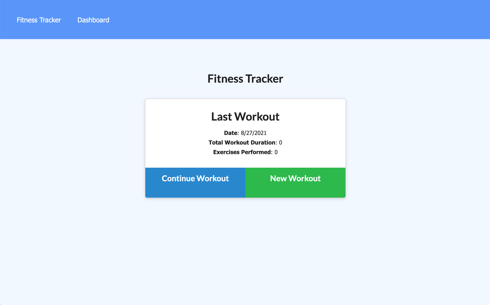

# Fitness Tracker

## Description 
This project is a fitness tracker that allows user to enter daily workout info as well as view their total exercise performance on a dashboard.

## Prerequisites
The user should clone the repository from GitHub.

## Installation
Clone this repository. 
- [Repository Link](https://github.com/c1am/fitness-tracker)
- [SSH Clone Link](git@github.com:c1am/fitness-tracker.git)
- [Heroku Deployment Link](https://cherrys-fitness-tracker.herokuapp.com/)

Install `node.js`, open the terminal and run `npm i` to install the packages below in the format of this example `npm i mysql2` for each package:
- express
- dotenv
- mongoose

## Screenshot of Deployed Application
 

## Built With
- Javascript
- MySQL
- Node
- MongoDB Atlas
- Heroku

## Authors
- Cherry Lam 
    - [GitHub](https://github.com/c1am)
    - [Email](mailto:cherrylam.ny@gmail.com)
